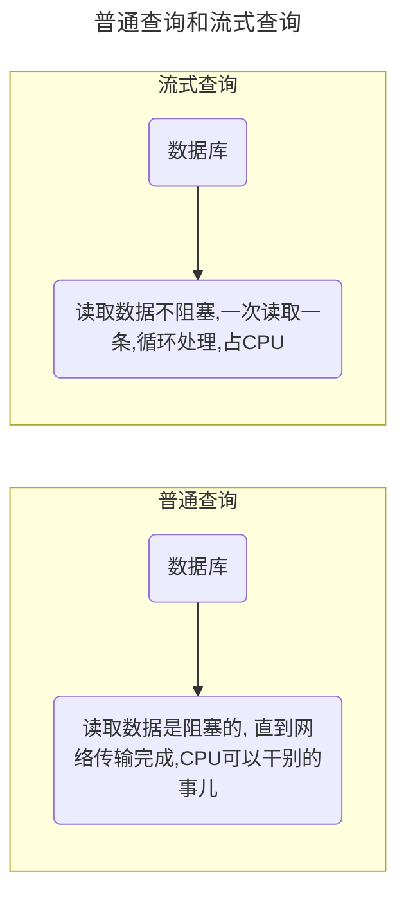

## 原理解析

### 这个场景是什么呢？
1. 业务要求进行数据导出，只不过数据量特别大；
2. 数据分析师需要这么多数据进行分析；
无论是哪种，都需要技术帮忙进行数据导出，但是一下子查询这么数据占用内存肯定特别大。如果直接使用ORM框架进行查询，内存怕是会直接炸掉（尤其是在可能存在并发的场景下）

遇到类似问题，先问一问，业务场景是否合理？一般excel也不能打开这么大数据量的文件，据我所知 office 2007 版也只能够打开104万行数据，03版只能打开65534行数据。

### 现有ORM在获取大量数据存在的问题
我经常使用的ORM框架是`mybatis`，优点是：轻量、快速集成、SQL可定制化程度高，尤其是在引入`mybatis-plus`之后，单表的增删改查也能够通过无SQL模式执行，同时提供有代码生成工具，十分方便。

MyBtais底层实现是通过JDBC打开连接，执行语句，获取结果，对结果进行映射，直至将所有结果处理之后再返回给调用者使用，数据少没有问题，但是遇到万级以上数据，这就有比较大的问题了，最基本的就是内存占用。

在高并发的场景下，根本不可能扛住这么大量的数据导出，或者计算。

### 解决办法
采用`流式查询`，或者`游标查询`，如果使用大量数据行的ResultSet，并且无法在JVM中为其分配所需要的内存空间，则可以告诉驱动程序从结果流中返回一行，将这一行数据写出到文件中，写出到流中以后，再访问下一行。
::: warning 注意
流式查询有一点需要注意：必须先读取（或关闭）结果集中的所有行，然后才能对连接发出其它查询，否则将引发异常

也就是说，不要再结果集中使用相同的连接干别的事儿。
:::

使用流式查询，则要保持对结果集的语句所引用的表的并发访问，因为查询会占用连接，所以必须尽快处理。

## 环境模拟说明
搭建一个新的SpringBoot + Mybatis项目，在数据库中创建500W数据，通过控制JVM内存大小，来模拟`普通查询`和`流式查询`下载文件，文件下载格式csv

### 数据准备
::: tabs

@tab:active Docker启动MySQL
``` bash
docker pull mysql:5.7

docker run -d --name mysql -p 3306:3306 -e MYSQL_ROOT_PASSWORD=root mysql:5.7
```

@tab MySQL创建DB和表
``` sql
create database stream_db charset utf8;

CREATE TABLE `t_stream` (
  `id` int(10) unsigned NOT NULL AUTO_INCREMENT COMMENT '主键',
  `name` varchar(255) DEFAULT NULL COMMENT '名称',
  `value` varchar(255) DEFAULT NULL COMMENT '值',
  `create_time` datetime NOT NULL DEFAULT CURRENT_TIMESTAMP COMMENT '创建时间',
  `update_time` datetime NOT NULL DEFAULT CURRENT_TIMESTAMP ON UPDATE CURRENT_TIMESTAMP COMMENT '更新时间',
  PRIMARY KEY (`id`)
);
```

@tab 存储过程
批量插入数据神器😄
``` sql
TRUNCATE TABLE t_stream;

delimiter ;;
CREATE PROCEDURE batch_insert(IN size INT)
BEGIN
	DECLARE i INT;
	SET i = 1;
	START TRANSACTION;
	WHILE(i <= size)DO
		INSERT INTO t_stream (id, `name`, `value`) VALUES (i, CONCAT('名称: ', i), size + i);
		SET i=i+1;
	END WHILE;
	COMMIT;
END
;;
delimiter ;

CALL batch_insert(5000000);

DROP PROCEDURE IF EXISTS batch_insert;
```

:::

## 框架搭建
::: tabs

@tab:active pom.xml
全部贴出来太大了，没必要，贴出关键的就行
``` xml
...
<parent>
    <groupId>org.springframework.boot</groupId>
    <artifactId>spring-boot-starter-parent</artifactId>
    <version>2.4.5</version>
    <relativePath/> <!-- lookup parent from repository -->
</parent>
...

<properties>
    <java.version>8</java.version>
</properties>
<dependencies>
    <dependency>
        <groupId>org.springframework.boot</groupId>
        <artifactId>spring-boot-starter-web</artifactId>
    </dependency>
    <dependency>
        <groupId>mysql</groupId>
        <artifactId>mysql-connector-java</artifactId>
        <version>8.0.28</version>
        <scope>runtime</scope>
    </dependency>
    <dependency>
        <groupId>com.baomidou</groupId>
        <artifactId>mybatis-plus-boot-starter</artifactId>
        <version>3.5.2</version>
    </dependency>
</dependencies>
```

@tab application.properties
``` properties
spring.datasource.url=jdbc:mysql://localhost:3306/stream_db?characterEncoding=utf8&useSSL=false
spring.datasource.username=root
spring.datasource.password=root
spring.datasource.driver-class-name=com.mysql.cj.jdbc.Driver
```

@tab StreamController.java
``` java
package com.example.exportbitdata;

import lombok.SneakyThrows;
import org.springframework.beans.factory.annotation.Autowired;
import org.springframework.http.HttpHeaders;
import org.springframework.stereotype.Controller;
import org.springframework.util.StopWatch;
import org.springframework.web.bind.annotation.RequestMapping;
import org.springframework.web.bind.annotation.RequestParam;

import javax.servlet.ServletOutputStream;
import javax.servlet.http.HttpServletResponse;
import java.io.BufferedWriter;
import java.io.IOException;
import java.io.OutputStreamWriter;
import java.util.List;
import java.util.Optional;

@Controller
public class StreamController {

    @Autowired
    private StreamMapper streamMapper;
    private static final char CONJ = ',';

    @RequestMapping("/normal")
    public void normal(@RequestParam(required = false) Integer size, HttpServletResponse response) throws IOException {
        StopWatch sw = new StopWatch("Normal Timer");
        sw.start("setting");
        downloadSetting(response);
        ServletOutputStream out = response.getOutputStream();
        BufferedWriter writer = new BufferedWriter(new OutputStreamWriter(out, "GB2312"), 1024);
        sw.stop();
        try {
            sw.start("Query Data");
            List<StreamDTO> streamDTOS = streamMapper.normalSelectLimit(Optional.ofNullable(size).orElse(50));
            sw.stop();
            sw.start("Write Data");
            for (StreamDTO streamDTO : streamDTOS) {
                writeRow(streamDTO, writer);
            }
            sw.stop();
            sw.start("Flush Data");
            writer.flush();
            sw.stop();
        } finally {
            writer.close();
            System.out.println(sw.prettyPrint());
        }
    }

    @RequestMapping("/stream")
    public void stream(@RequestParam(required = false) Integer size, HttpServletResponse response) throws IOException {
        StopWatch sw = new StopWatch("Stream Timer");
        sw.start("setting");
        downloadSetting(response);
        ServletOutputStream out = response.getOutputStream();
        BufferedWriter writer = new BufferedWriter(new OutputStreamWriter(out, "GB2312"), 1024);
        sw.stop();
        try {
            sw.start("Query&Write Data");
            streamMapper.streamSelectLimit(Optional.ofNullable(size).orElse(50), resultContext -> {
                StreamDTO one = resultContext.getResultObject();
                writeRow(one, writer);
            });
            sw.stop();
            sw.start("Flush Data");
            writer.flush();
            sw.stop();
        } finally {
            writer.close();
            System.out.println(sw.prettyPrint());
        }
    }

    private void downloadSetting(HttpServletResponse response) {
        response.setContentType("application/csv;charset=gb2312");
        response.setHeader(HttpHeaders.CONTENT_DISPOSITION, "attachment; filename=" + System.currentTimeMillis() + ".csv");
    }

    @SneakyThrows
    private void writeRow(StreamDTO data, BufferedWriter writer) {
        writer.write(data.getId().toString());
        writer.write(CONJ);
        writer.write(data.getName());
        writer.write(CONJ);
        writer.write(data.getValue());
        writer.write('\n');
    }
}

```

@tab StreamMapper.java
``` java
package com.example.exportbitdata;

import org.apache.ibatis.annotations.*;
import org.apache.ibatis.mapping.ResultSetType;
import org.apache.ibatis.session.ResultHandler;
import org.springframework.stereotype.Repository;

import java.util.List;

@Mapper
@Repository
public interface StreamMapper {

    @Select("SELECT * FROM t_stream LIMIT #{size}")
    List<StreamDTO> normalSelectLimit(int size);

    @Options(resultSetType = ResultSetType.FORWARD_ONLY, fetchSize = Integer.MIN_VALUE)
    @ResultType(StreamDTO.class)
    @Select("SELECT * FROM t_stream LIMIT #{size}")
    void streamSelectLimit(@Param("size") int size, ResultHandler<StreamDTO> handler);
}
```

@tab 测试启动脚本
``` bash
# 启动命令
java -Xmx20m -Xms20m -jar export-bit-data-0.0.1-SNAPSHOT.jar

# 访问命令
curl http://localhost:8080/normal?size=5000000  # 这个直接出现OOM
curl http://localhost:8080/stream?size=5000000  # 这个可以直接运行的到结果
```

:::

以上可以得出一个结论，流式查询在解决缓存占用方面有着极大的优势，并且在测试单次查询速度时，优势也是非常大的。

本次工程没有测试多线程环境下的执行效率，以及在高并发环境下，会不会出现别的问题。

::: warning 注意

流式查询比较依赖CPU

对比一下普通查询流程和流式查询流程：  


:::

## 参考文档
- [MySQL以cursor方式读取（useCursorFetch，FetchSize参数）](https://blog.51cto.com/u_15127595/3391934)
- [如何通过 MyBatis 查询千万数据并保证内存不溢出?](https://zhuanlan.zhihu.com/p/373351899)
- [MySQL如何流式读取千万级大数据](https://zhuanlan.zhihu.com/p/421952313)
- [炸了！使用 MyBatis 查询千万数据量？](https://zhuanlan.zhihu.com/p/341012871)